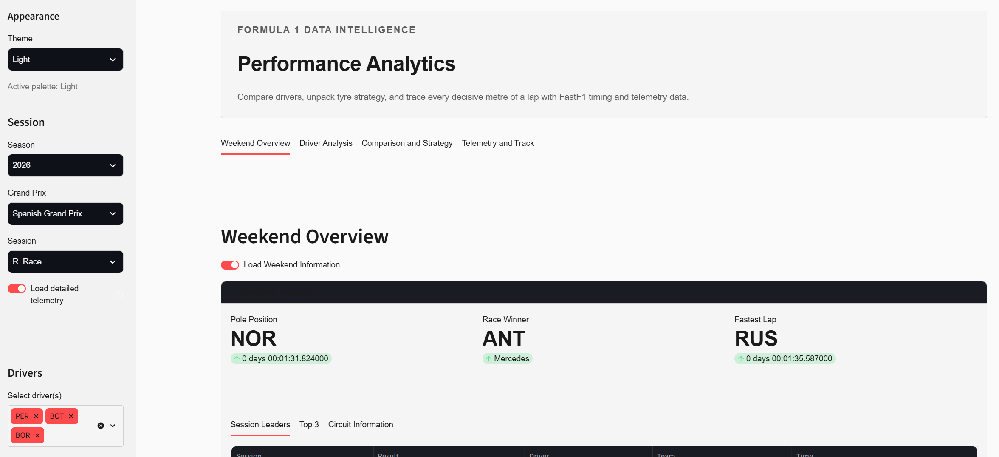
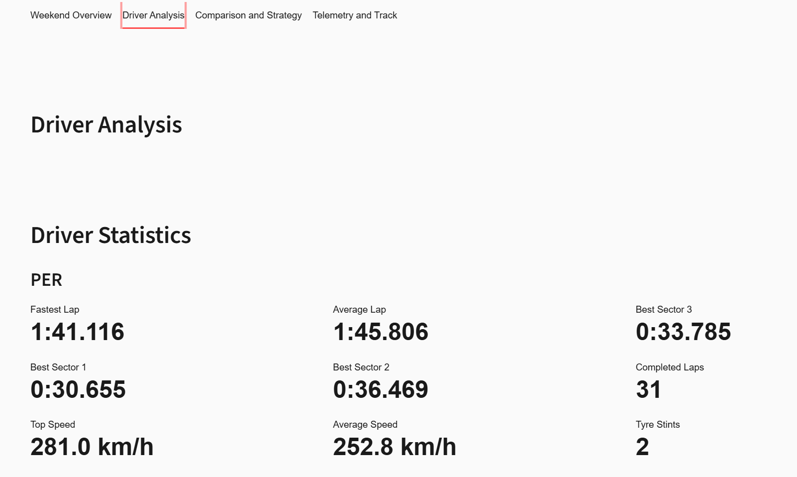
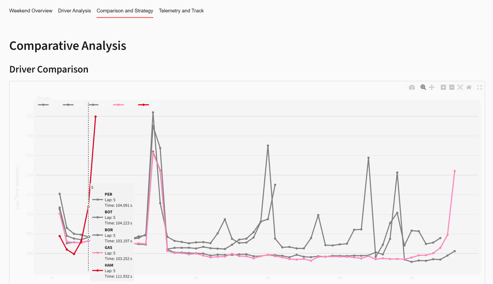
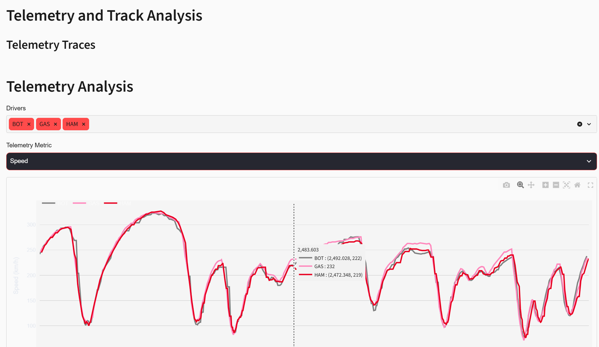

# F1 Performance Analytics

An interactive Formula 1 analysis dashboard for lap times, sectors, tyres, strategy, weather, and telemetry — built on top of the [FastF1](https://docs.fastf1.dev/) open-source timing data.


> Educational and portfolio project. Not affiliated with Formula 1, the FIA, or any Formula 1 team.

---

## Screenshots

<!-- Drop screenshots into docs/screenshots/ and uncomment the images below. -->

<!--  -->
<!--  -->
<!--  -->
<!--  -->

_Screenshots coming soon._

---

## Features

- **Four focused tabs** instead of one long scroll — Weekend Overview, Driver Analysis, Comparison and Strategy, Telemetry and Track.
- **Multi-driver comparison** of lap times, sectors, tyre performance, pace consistency, stints, and pit stops.
- **Telemetry deep-dive** (opt-in): distance-based speed / throttle / brake / gear / RPM traces, racing-line track map, corner analysis, mini sectors, and speed traps.
- **Session weather** with temperature trends, humidity, wind, and rainfall.
- **Fast reruns** thanks to three cache layers stacked on top of FastF1 — switching tabs or drivers doesn't re-parse the session.
- **Six themes**: Dark, Light, Ferrari, Mercedes, Aston Martin, and Pink.
- **CSV download** of the displayed telemetry.
- Graceful handling of missing telemetry channels and empty data.

## Themes

The sidebar has a theme selector with six palettes. All charts, cards, and controls repaint to match:

| Theme | Vibe |
| --- | --- |
| Dark | Neutral near-black, muted red accent (default) |
| Light | Soft off-white |
| Ferrari | Deep maroon with red / gold accents |
| Mercedes | Dark teal with muted silver accent |
| Aston Martin | Dark racing green with lime accent |
| Pink | Dusty rose with magenta accent |

## Quick start

```bash
git clone https://github.com/nimishavarma27/f1_performance_analysis.git
cd f1_performance_analysis
python -m venv .venv
```

Activate the venv:

```bash
# Windows PowerShell
.\.venv\Scripts\Activate.ps1

# Windows Command Prompt
.venv\Scripts\activate

# macOS / Linux
source .venv/bin/activate
```

Install and run:

```bash
pip install -r requirements.txt
streamlit run app.py
```

Open the local URL Streamlit prints (usually `http://localhost:8501`), pick a session, and select one or more drivers. Enable **Load detailed telemetry** in the sidebar when you want the Telemetry tab.

> Season selection is capped at **2018 onwards** because FastF1 telemetry coverage before that era is inconsistent.

## Tech stack

| Layer | Library |
| --- | --- |
| Data | [FastF1](https://docs.fastf1.dev/) |
| UI | [Streamlit](https://streamlit.io/) |
| Analysis | [Pandas](https://pandas.pydata.org/), [NumPy](https://numpy.org/) |
| Charts | [Plotly](https://plotly.com/python/) |

## Project structure

```text
f1_performance_analysis/
├── app.py                 Streamlit entry point (tabbed layout)
├── assets/styles.css      Flat, restrained visual system
├── loaders/               Cached FastF1 session loading
├── processing/            Raw FastF1 data -> analysis DataFrames
├── visualization/         Plotly charts and Streamlit display helpers
├── views/                 One module per dashboard tab
├── utils/                 Themes, colours, logging, UI helpers
├── data/cache/            Generated FastF1 cache (do not commit)
└── docs/ARCHITECTURE.md   Detailed layering, caching, and per-file reference
```

For a full per-file reference, layering diagram, and instructions on adding a tab or theme, see [`docs/ARCHITECTURE.md`](docs/ARCHITECTURE.md).

## Roadmap

Short version — full details in the architecture doc.

- **Now**: tabbed layout, session and telemetry caching, six themes, restrained styling, vectorised analyses. ✅
- **Next**: dedicated two-driver head-to-head panel, distance-based delta-time chart, weather-aware lap filtering.
- **Later**: typed session models, automated tests, GitHub Actions CI, hosted deployment.

## Contributing

Contributions are welcome. Keep calculation logic in `processing/` and presentation logic in `visualization/` or `views/`. Update [`docs/ARCHITECTURE.md`](docs/ARCHITECTURE.md) when you add a module. See its "Adding a new tab" and "Adding a new theme" sections for the fastest path in.

## Acknowledgements

- [FastF1](https://github.com/theOehrly/Fast-F1) for the Formula 1 data-access library.
- Formula 1 and the FIA for the sport and timing ecosystem that make this analysis possible.
- The Streamlit, Pandas, NumPy, and Plotly open-source communities.

## License

No license file yet — until one is added, treat the repository as all rights reserved by its owner.
